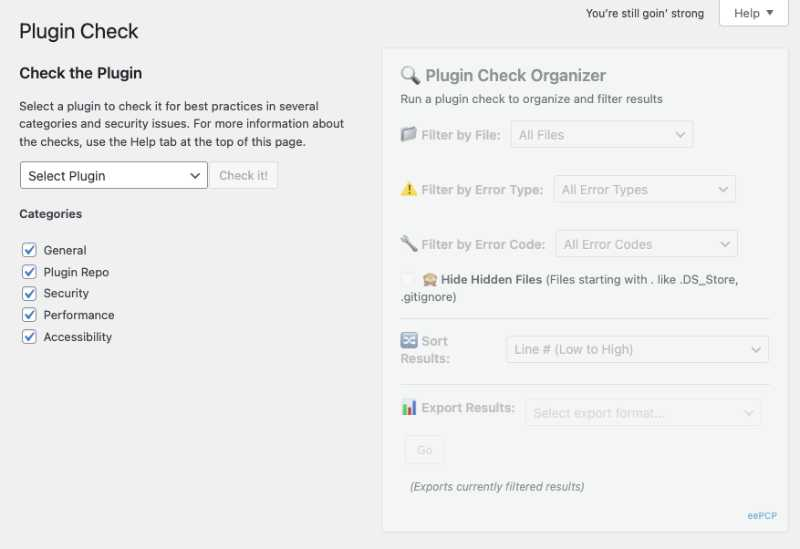
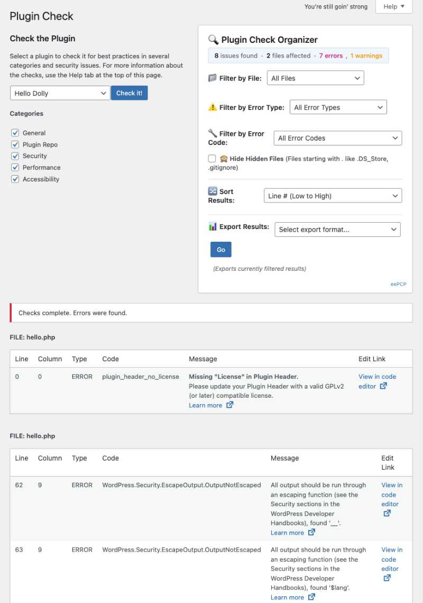
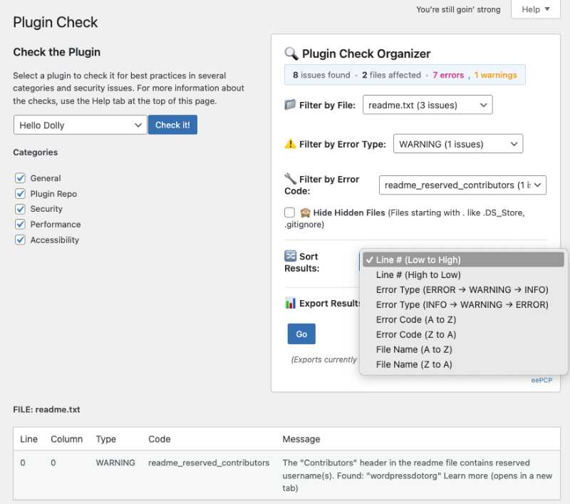
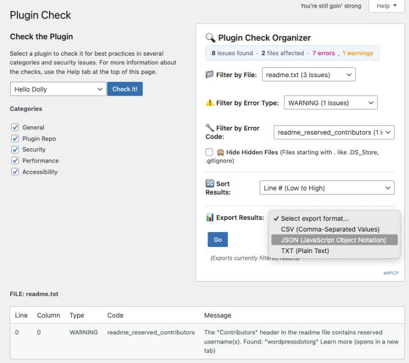

# EE Plugin Check Organizer

[](https://wordpress.org)
[](https://www.gnu.org/licenses/gpl-2.0)
[]()

**Enhance the WordPress Plugin Check tool with powerful filtering, sorting, and export capabilities.**

Transform your WordPress Plugin Check experience from overwhelming lists to organized, actionable insights. This plugin adds a sophisticated filtering interface that makes it easy to focus on what matters most in your plugin compliance review.

## 📸 Screenshots

### Interface Overview

*Clean, professional interface that integrates seamlessly with WordPress Plugin Check*

### Scan Results with Real-Time Statistics

*Live statistics display showing issues found, files affected, and error breakdown*

### Advanced Dynamic Filtering

*Smart cascading filters - file and error type selections automatically update available options*

### Export Functionality

*Export filtered results in CSV, JSON, or TXT formats for team collaboration and analysis*

## � Features

- Optionally excludes system files (`.DS_Store`, `.gitignore`) from file dropdown

- Optional toggle to show/hide hidden file issues in results

### 🎯 **Non-Invasive DOM-Only Approach**

- Keeps your interface clean and focused on actual code files

- **Admin-only scope** - no frontend impact

- **Pure DOM manipulation** - works entirely with existing Plugin Check interface elements

- **No database changes** - zero impact on your WordPress database

- **No core modifications** - doesn't alter Plugin Check plugin files

- **Namespaced globals** - exposes `window.eePluginCheckOrganizer` API

- **Core styling integration** - leverages WordPress admin CSS classes (`widefat`, `striped`)

### 📈 **Advanced Sorting Options**

- **Line Number** - Default numeric sorting for logical code review flow

- **Error Type** - Group by severity (ERROR → WARNING → INFO)

### 🔍 **Smart Triple Filtering System**
- **File Filter** - Focus on specific plugin files
- **Error Type Filter** - Filter by ERROR, WARNING, or INFO severity
- **Error Code Filter** - Target specific WordPress coding standards violations

### 📊 **Dynamic Cascading Filters**
- Error code dropdown automatically updates based on your file and error type selections
- Only shows error codes that actually exist in your current filtered results
- Eliminates confusion from irrelevant options

### 🙈 **Hidden Files Management**
- Optionally exclude system files (`.DS_Store`, `.gitignore`) from file dropdown
- Optional toggle to show/hide hidden file issues in results
- Keeps your interface clean and focused on actual code files

### � **Advanced Sorting Options**
- **Line Number** - Default numeric sorting for logical code review flow
- **Error Type** - Group by severity (ERROR → WARNING → INFO)
- **Error Code** - Alphabetical sorting by WordPress coding standards
- **File Name** - Alphabetical file organization

### 📤 **Comprehensive Export System**
Export your filtered results in multiple formats:
- **CSV** - Perfect for spreadsheet analysis and sharing with teams
- **JSON** - Structured data for programmatic analysis and AI tools
- **TXT** - Human-readable format for documentation and reports

All exports include timestamps and active filter information.

### ⚡ **Performance & User Experience**
- **Real-time filtering** - Instant results as you change filters
- **Responsive design** - Works perfectly on desktop, tablet, and mobile
- **Non-invasive enhancement** - Never interferes with original Plugin Check functionality
- **Progressive enhancement** - Graceful degradation if JavaScript fails
- **Multi-check support** - Handles multiple Plugin Check runs in the same session

## 📋 Requirements

- **WordPress** 5.0 or higher
- **PHP** 7.4 or higher
- **Plugin Check Plugin** (official WordPress plugin)

## 🛠 Installation

### From GitHub Release

1. Download the latest release ZIP file from the [Releases page](../../releases)
2. In your WordPress admin, go to **Plugins → Add New → Upload Plugin**
3. Choose the downloaded ZIP file and click **Install Now**
4. Click **Activate Plugin**

### Manual Installation

1. Download or clone this repository
2. Upload the `ee-plugin-check-organizer` folder to `/wp-content/plugins/`
3. Activate the plugin through the **Plugins** menu in WordPress

## 🎯 Usage

1. **Install and activate** the Plugin Check plugin if you haven't already
2. **Navigate** to **Tools → Plugin Check** in your WordPress admin
3. **Run a plugin check** as you normally would
4. **Wait for completion** - the organizer interface will automatically appear
5. **Use the filters** to focus on specific issues:
   - Select a specific file to review
   - Choose error types (ERROR, WARNING, INFO)
   - Pick specific error codes from the dynamic dropdown
   - Toggle hidden files visibility as needed
6. **Sort results** using the sorting dropdown for your preferred review order
7. **Export results** in your preferred format for further analysis

## 🔧 Technical Architecture

This plugin follows WordPress best practices and modern web development standards:

- **Client-side DOM manipulation** for optimal performance
- **MutationObserver pattern** for dynamic content detection
- **Progressive enhancement** architecture
- **No database dependencies** - all functionality is ephemeral
- **WordPress coding standards** compliant
- **jQuery-based** for maximum WordPress compatibility

For detailed technical documentation, see [TECHNICAL-DOCS.md](TECHNICAL-DOCS.md).

**Design Pattern: WordPress Core Class Extension**

We welcome contributions from the WordPress community! Here's how you can help:

```css

- 🐛 **Report bugs** via [GitHub Issues](../../issues)/* Extends WordPress core admin table classes */

- 💡 **Suggest features** through [GitHub Issues](../../issues).ee-filter-container { /* Custom container styling */ }

- 🔧 **Submit pull requests** following our [Contributing Guidelines](CONTRIBUTING.md).ee-filter-dropdown-group { /* Dropdown group styling */ }

- 📖 **Improve documentation**

- 🧪 **Help with testing** across different WordPress setups/* Leverages existing WordPress classes: */

/* .widefat, .striped, .form-table */

See [CONTRIBUTING.md](CONTRIBUTING.md) for detailed guidelines.```


## 📝 Changelog## Technical Implementation Patterns


See [CHANGELOG.md](CHANGELOG.md) for version history and release notes.### 1. DOM Detection and Initialization

```javascript

## 📄 License// Target Element Detection

const categoriesTable = $('#plugin-check__categories');

This project is licensed under the GPL v2 or later - see the [LICENSE](LICENSE) file for details.const resultsContainer = $('#plugin-check__results');


## 💡 Why This Plugin?// Conditional Initialization

if (categoriesTable.length === 0) return; // Exit if not Plugin Check page

The WordPress Plugin Check tool is invaluable for ensuring compliance with WordPress.org standards, but the default output can be overwhelming. This organizer transforms that experience by:```


1. **Reducing cognitive load** with smart filtering### 2. Mutation Observer Pattern for Dynamic Content

2. **Enabling focused reviews** of specific issue types```javascript

3. **Streamlining team collaboration** with export capabilitiesconst observer = new MutationObserver(function(mutations) {

4. **Maintaining workflow efficiency** with real-time filtering    // Watch for "Checks complete" notice

5. **Supporting systematic fixes** through organized presentation    // Trigger result processing when Plugin Check finishes

});

Perfect for:

- **Plugin developers** preparing for WordPress.org submissionobserver.observe(document.body, {

- **Development teams** conducting code reviews    childList: true,

- **Quality assurance** professionals managing compliance    subtree: true

- **WordPress agencies** maintaining plugin portfolios});

```

## 🆘 Support

### 3. State Management Architecture

- 📖 **Documentation**: [TECHNICAL-DOCS.md](TECHNICAL-DOCS.md)```javascript

- 🐛 **Bug Reports**: [GitHub Issues](../../issues)// Original Results Storage

- 💬 **Questions**: [GitHub Discussions](../../discussions)function storeOriginalResults() {

    originalResults = []; // Parse and store DOM structure

## 🙏 Acknowledgments    allFileBlocks = [];   // Cache file-level data

}

- WordPress Plugin Check team for the excellent foundation tool

- WordPress community for coding standards and best practices// Filter Application

- ElementEngage team for development and maintenancefunction applyFilters() {

    // Read current filter states

---    // Transform stored data based on filters

    // Regenerate DOM structure

**Developed by [ElementEngage](https://elementengage.com)** | **Maintained by [@eemitch](https://github.com/eemitch)**}
```

### 4. Triple Filter System Design
**Independent Filter Architecture**: Each filter operates independently and can be combined

```javascript
// Filter Types:
// 1. File Filter: Groups results by filename
// 2. Error Type Filter: Groups by ERROR/WARNING/INFO
// 3. Error Code Filter: Groups by specific WordPress coding standards

// Filter Combination Logic:
if (selectedFile !== 'all') { /* File-specific filtering */ }
if (selectedErrorType !== 'all') { /* Error type filtering */ }
if (selectedErrorCode !== 'all') { /* Error code filtering */ }
```

### 5. Sorting System Design
**Stateful Sort Architecture**: Maintains sort field and direction with default line number sorting

```javascript
// Sort State Management:
## 🤝 Contributing

We welcome contributions from the WordPress community! Here's how you can help:

- 🐛 **Report bugs** via [GitHub Issues](../../issues)
- 💡 **Suggest features** through [GitHub Issues](../../issues)
- 🔧 **Submit pull requests** following our [Contributing Guidelines](CONTRIBUTING.md)
- 📖 **Improve documentation**
- 🧪 **Help with testing** across different WordPress setups

See [CONTRIBUTING.md](CONTRIBUTING.md) for detailed guidelines.

## 📝 Changelog

See [CHANGELOG.md](CHANGELOG.md) for version history and release notes.

## 📄 License

This project is licensed under the GPL v2 or later - see the [LICENSE](LICENSE) file for details.

## 💡 Why This Plugin?

The WordPress Plugin Check tool is invaluable for ensuring compliance with WordPress.org standards, but the default output can be overwhelming. This organizer transforms that experience by:

1. **Reducing cognitive load** with smart filtering
2. **Enabling focused reviews** of specific issue types
3. **Streamlining team collaboration** with export capabilities
4. **Maintaining workflow efficiency** with real-time filtering
5. **Supporting systematic fixes** through organized presentation

Perfect for:
- **Plugin developers** preparing for WordPress.org submission
- **Development teams** conducting code reviews
- **Quality assurance** professionals managing compliance
- **WordPress agencies** maintaining plugin portfolios

## 🆘 Support

- 📖 **Documentation**: [TECHNICAL-DOCS.md](TECHNICAL-DOCS.md)
- 🐛 **Bug Reports**: [GitHub Issues](../../issues)
- 💬 **Questions**: [GitHub Discussions](../../discussions)

## 🙏 Acknowledgments

- WordPress Plugin Check team for the excellent foundation tool
- WordPress community for coding standards and best practices
- ElementEngage team for development and maintenance

---

**Developed by [ElementEngage](https://elementengage.com)** | **Maintained by [@eemitch](https://github.com/eemitch)**

### 3. Cascading Filter Update Flow (NEW)
```
User changes File or Error Type filter
→ updateErrorCodeDropdown() triggered
→ Filters originalResults by current File + Error Type + Hidden Files setting
→ Generates new Error Code options from filtered data only
→ Preserves existing Error Code selection if still valid
→ Triggers applyFilters() to update display
```

### 4. Filter Application Flow (Enhanced)
```
User selects filter option or toggles hidden files
→ applyFilters() triggered
→ Always hides original Plugin Check results
→ Data filtered based on all selections:
   - File filter
   - Error Type filter
   - Error Code filter
   - Hidden files checkbox
→ Sorting applied (default: line number ascending)
→ createFilteredResultsByFile() generates organized structure
→ DOM updated with filtered results
→ WordPress table classes applied
```

### 5. Export Flow
```
User clicks export button (CSV/JSON/TXT)
→ exportResults() triggered with format parameter
→ getCurrentlyDisplayedResults() gets filtered data
→ Format-specific generation function called:
   - generateCSV() for comma-separated values
   - generateJSON() for structured JSON with metadata
   - generateTXT() for human-readable text format
→ downloadFile() creates blob and triggers download
→ File saved with timestamp: plugin-check-results_YYYY-MM-DD_HH-MM.ext
```

### 5. Sort Flow
```
User clicks sort button (Line #/Error Type/Error Code/File Name)
→ sortResults() triggered with sort field parameter
→ currentSort state updated (field + direction toggle)
→ updateSortIndicator() updates UI:
   - Highlights active sort button (button-primary)
   - Shows sort direction with arrow (↑/↓)
   - Updates sort indicator text
→ applyFilters() re-triggered with new sort order
→ applySorting() called with comparison logic:
   - Line: Numeric comparison (1, 2, 10, 45...)
   - Type: Severity order (ERROR → WARNING → INFO)
   - Code: Alphabetical comparison
   - File: Alphabetical comparison
→ Results redisplayed in new sort order
```

## Debug Mode System

### Debug Mode Toggle
```javascript
const DEBUG_MODE = true; // Set to false for production

// Debug-only features:
if (DEBUG_MODE) {
    window.eePluginCheckOrganizer.testScan = function() { /* Manual testing */ };
    window.eePluginCheckOrganizer.debugMode = true;
    // Raw array output display
    // Enhanced console logging
}
```

### Debug Functions Available
- `debugLog()` - Conditional console logging
- `testScan()` - Manual result scanning trigger
- `createDebugOutput()` - Raw data display for development

## Export System

### Export Formats Supported
1. **CSV (Comma-Separated Values)**
   - Standard tabular format for spreadsheet applications
   - Headers: File, Line, Column, Type, Code, Message
   - Automatic field escaping for commas and quotes
   - Perfect for analysis in Excel, Google Sheets

2. **JSON (JavaScript Object Notation)**
   - Structured data with metadata
   - Includes export timestamp, total issues count, active filters
   - Nested structure with issue arrays
   - Ideal for programmatic analysis and AI processing

3. **TXT (Plain Text)**
   - Human-readable format grouped by file
   - Includes export header with timestamp and counts
   - File-grouped layout for easy reading
   - Perfect for sharing results in emails or documentation

### Export Data Structure
```javascript
// CSV: Simple tabular format
File,Line,Column,Type,Code,Message
"functions.php","45","12","ERROR","WordPress.Security.EscapeOutput.OutputNotEscaped","Data is output without being escaped"

// JSON: Structured with metadata
{
  "exportedAt": "2025-09-17T10:30:00.000Z",
  "totalIssues": 15,
  "filters": {
    "file": "functions.php",
    "errorType": "ERROR",
    "errorCode": "all"
  },
  "issues": [...]
}

// TXT: Human-readable format
FILE: functions.php
-------------------
Line 45, Column 12: [ERROR] WordPress.Security.EscapeOutput.OutputNotEscaped
  Data is output without being escaped
```

### Export Functions Available
- `exportResults(format)` - Main export function with format parameter
- `getCurrentlyDisplayedResults()` - Gets filtered data for export
- `generateCSV()` - Creates CSV format string
- `generateJSON()` - Creates JSON format string
- `generateTXT()` - Creates TXT format string
- `downloadFile()` - Handles browser download with proper MIME types

### File Naming Convention
All exports use timestamp-based naming:
```
plugin-check-results_YYYY-MM-DD_HH-MM.{ext}
Example: plugin-check-results_2025-09-17_10-30.csv
```

## WordPress Integration Points

### 1. Hook Integration
```php
add_action('admin_enqueue_scripts', array($this, 'enqueue_scripts'));
add_action('admin_footer', array($this, 'add_filter_interface'));
```

### 2. Conditional Loading
```php
public function enqueue_scripts($hook) {
    $screen = get_current_screen();
    if ($screen && $screen->id === 'tools_page_plugin-check') {
        // Load only on Plugin Check pages
    }
}
```

### 3. Global API Exposure
```javascript
window.eePluginCheckOrganizer = {
    refreshResults: refreshResults,
    exportResults: exportResults,
    // Debug mode additions:
    testScan: function() { /* ... */ },
    exportCSV: function() { /* Export to CSV */ },
    exportJSON: function() { /* Export to JSON */ },
    exportTXT: function() { /* Export to TXT */ },
    debugMode: true
};
```

## CSS Architecture Philosophy

### WordPress Core Integration Strategy
- **Extend, don't override**: Uses WordPress core classes as base
- **Minimal custom CSS**: Only adds styling not available in WordPress core
- **Responsive by default**: Leverages WordPress responsive patterns
- **Admin theme compatibility**: Works with any WordPress admin color scheme

### Key CSS Classes
```css
/* Custom classes for plugin-specific elements */
.ee-filter-container
.ee-filter-dropdown-group

/* WordPress core classes leveraged */
.widefat (table width and styling)
.striped (alternating row colors)
.form-table (form layout consistency)
```

## Error Handling Philosophy

### Graceful Degradation Patterns
1. **DOM Detection Failures**: Plugin exits silently if Plugin Check DOM not found
2. **Result Parsing Failures**: Filter interface remains disabled but doesn't break
3. **Filter Application Failures**: Falls back to original results display
4. **Debug Mode Safeguards**: Debug features only available when explicitly enabled

### Error Recovery Mechanisms
```javascript
// Example: Safe DOM parsing
try {
    // Parse Plugin Check results
} catch (error) {
    debugLog('Parse error, falling back to original display');
    // Continue without filtering capability
}
```

## Performance Considerations

### 1. Minimal DOM Manipulation
- **Store original state**: Avoid re-parsing DOM on each filter change
- **Batch updates**: Update entire result sections at once, not individual elements
- **Event delegation**: Use jQuery event delegation to minimize event listeners

### 2. Memory Management
- **Result caching**: Store parsed results in memory for quick filtering
- **Observer cleanup**: Disconnect MutationObserver after completion detection
- **Selective loading**: Only process data when actually needed

### 3. Initialization Optimization
- **Conditional execution**: Only run on Plugin Check pages
- **Deferred processing**: Wait for Plugin Check completion before major processing
- **Progressive enhancement**: Core functionality works immediately, enhanced features load after

## Extension Points for AI Agents

### 1. Adding New Filter Types
To add a new filter type, implement:
```javascript
function getNewFilterOptionsHtml(hasResults) {
    // Generate dropdown options
}

// Add to createFilterInterface()
// Add logic to applyFilters()
```

### 2. Modifying Result Display
Key function to modify: `createFilteredResultsByFile()`
```javascript
// This function controls how filtered results are displayed
// Modify HTML generation here for different layouts
```

### 3. Debug Mode Extensions
```javascript
if (DEBUG_MODE) {
    // Add new debug functions here
    window.eePluginCheckOrganizer.newDebugFunction = function() {
        // Your debug functionality
    };
}
```

### 4. WordPress Integration Extensions
```php
// Add new hooks in functions.php
add_action('admin_head', array($this, 'add_custom_admin_styles'));
add_filter('plugin_action_links_' . plugin_basename(__FILE__), array($this, 'add_settings_link'));
```

## Testing and Validation Approaches

### 1. Debug Mode Testing
- Enable `DEBUG_MODE = true`
- Use `testScan()` function for manual testing
- Check browser console for debug output
- Verify raw data array output below results

### 2. WordPress Compatibility Testing
- Test with different admin themes
- Verify responsive behavior
- Test with/without other plugins active
- Validate on different WordPress versions

### 3. Plugin Check Integration Testing
- Test with different plugin types (simple, complex, multi-file)
- Test with different error types and quantities
- Verify behavior with empty results
- Test Plugin Check completion detection

## Version Control and Release Management

### Debug Mode for Development
- Keep `DEBUG_MODE = true` during development
- Set `DEBUG_MODE = false` for production releases
- Use debug mode to validate new features
- Debug mode provides troubleshooting capabilities for AI agents

### Release Checklist for AI Agents
1. Set `DEBUG_MODE = false` in main.js
2. Update version number in functions.php
3. Update readme.txt with new features
4. Test with Plugin Check on multiple plugin types
5. Validate WordPress coding standards compliance
6. Test responsive behavior
7. Verify no console errors in production mode

### Current Status (September 2025)

**Stability**: Production-ready with comprehensive enhancements
**Features**: All major functionality implemented and tested
**Performance**: Optimized for multiple Plugin Check runs and large result sets
**Compatibility**: Works with all WordPress Plugin Check versions

**Key Improvements Completed**:
- ✅ Dynamic cascading filters
- ✅ Hidden files management
- ✅ Enhanced sorting with sensible defaults
- ✅ Robust state management
- ✅ Non-invasive display architecture
- ✅ Multi-check session support

**Next Phase**: Focus shifts to using the organizer for systematic WordPress plugin compliance fixes.

---

**Last Updated**: September 18, 2025
**Status**: Ready for production use
**Maintained By**: ElementEngage Development Team

